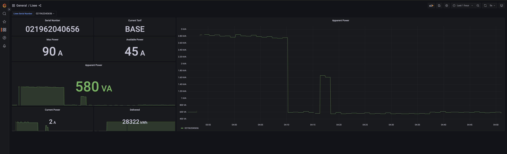

# Exporter for Lixee

Exporter for Lixee is a Prometheus exporter designed to help monitor your Lixee setup by exporting
relevant metrics to Prometheus.

## Integrate with Grafana

To integrate the metrics from Prometheus into Grafana, ensure the Prometheus is added as a Datasource. Next you can import the example dashboard from`./grafana`

  

## Contributing

We welcome contributions to improve the exporter. Feel free to fork the repository, make changes, and submit a pull
request. For major changes, please open an issue first to discuss what you would like to change.

## License

This project is licensed under the MIT License - [see the LICENSE file for details](./LICENSE.md).
